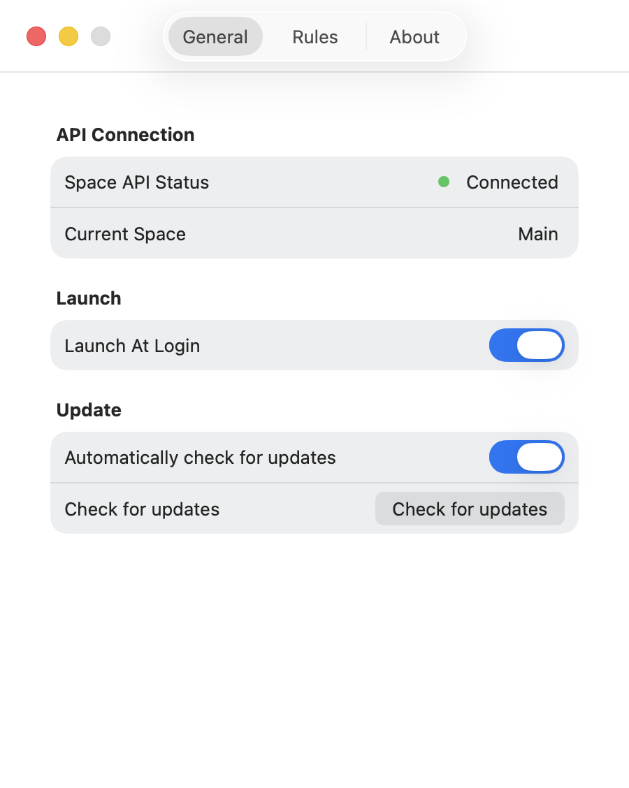
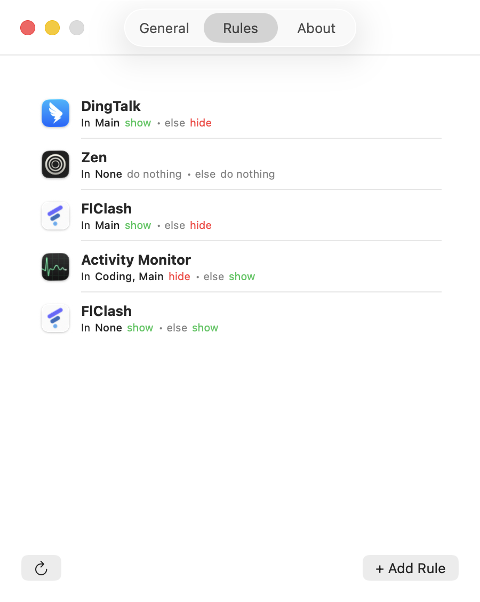

<!-- v0.1.0-beta.1 -->

<h1 align="center">
    
  

  
SpaceSwitcher

</h1>

<table align="center" border="0" cellpadding="0" cellspacing="0">
  <tr>
    <td align="center">
       
      <i>
      Connect to
      <a href=https://github.com/gitmichaelqiu/DesktopRenamer>
      DesktopRenamer's SpaceAPI
      </a>
      </i>
    </td>
    <td align="center">
       
      <i>Add custom rules to each space</i>
    </td>
  </tr>
</table>

**SpaceSwitcher** is a macOS workspace enhancer that lets you control **which app to show** in each workspace. Especially for apps that you have **assigned to all desktops**.

## 📦 Installation

Requires **macOS 13.0 Ventura** or above.

1. If you haven't, install [DesktopRenamer](https://github.com/gitmichaelqiu/DesktopRenamer/releases/), which provides necessary SpaceAPI to inform SpaceSwitcher the current space info
2. Start SpaceAPI in DesktopRenamer Settings → General
3. Download the SpaceSwitcher from [Releases](https://github.com/gitmichaelqiu/SpaceSwitcher/releases/)
4. Drag the app to the *Applications* folder
5. All set!

Because I do **NOT** have an Apple developer account for the app releases ~~(Apple charges an annual fee for this)~~, you may receive alerts such as "App is broken".

To resolve this, go to System Settings → the bottom of Privacy & Security → Open DesktopRenamer.

## 🛜 SpaceAPI

To get the current space's information, an extra app DesktopRenamer is required. You can download it [here](https://github.com/gitmichaelqiu/DesktopRenamer/releases/).

After downloading DesktopRenamer, you need to turn on SpaceAPI in Settings → General.

## 💡 Tips

The app will not work as expected when you connect to **multiple** displays, for an issue in DesktopRenamer. I am currently working on solving this. If you have any ideas, you are welcomed to post them in [DesktopRenamer Issues](https://github.com/gitmichaelqiu/DesktopRenamer/issues).

## ⚠️ Issues/Suggestions

You are welcome to create issues/suggestions in [GitHub Issues](https://github.com/gitmichaelqiu/DesktopRenamer/issues).

## ⭐ Support This Project

You can simply click on the **Star** to support this project for free. Thank you for your support!

