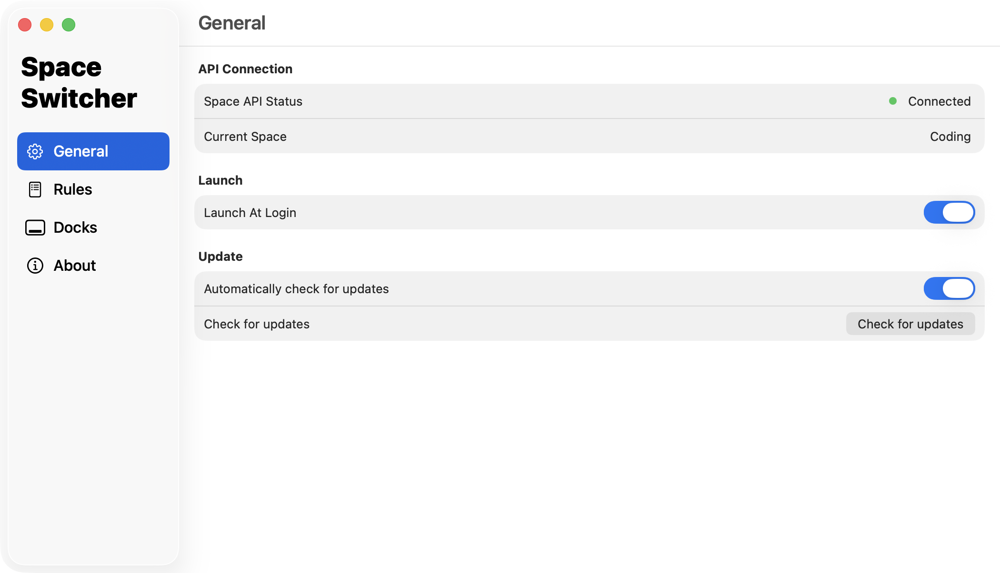
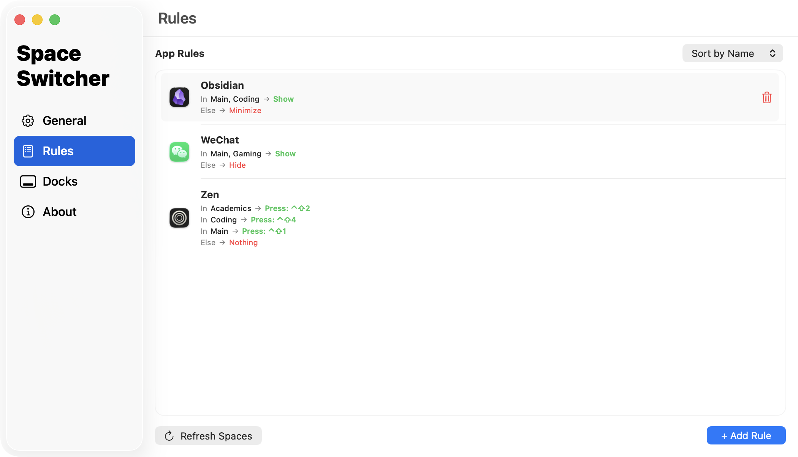
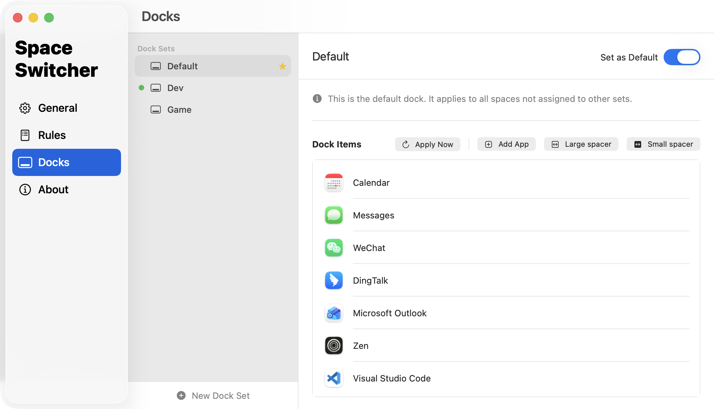

<!-- v0.2.0-beta.1 -->

<h1 align="center">
    
  <p></p>
  <p align="center">SpaceSwitcher</p>
</h1>

<h3>
<p align="center"><i>Customize space experiences.</i></p>
</h3>

<table align="center" border="0" cellpadding="0" cellspacing="0">
  <tr>
    <td align="center">
      <br>
      <i>
      Connect to
      <a href=https://github.com/gitmichaelqiu/DesktopRenamer>
      DesktopRenamer's SpaceAPI
      </a>
      </i>
    </td>
  </tr>
  <tr>
    <td align="center">
      <br>
      <i>Add custom rules to each space</i>
    </td>
    <td align="center">
      <br>
      <i>Different docks for each space</i>
    </td>
  </tr>
</table>

**SpaceSwitcher** is a macOS workspace enhancer that lets you control **which app and dock to show** in each workspace.

## 📦 Installation

Requires **macOS 13.0 Ventura** or above.

### Direct Download

1. If you haven't, install [DesktopRenamer](https://github.com/gitmichaelqiu/DesktopRenamer/releases/), which provides necessary SpaceAPI to inform SpaceSwitcher the current space info
2. Start SpaceAPI in DesktopRenamer Settings → General
3. Download the SpaceSwitcher from [Releases](https://github.com/gitmichaelqiu/SpaceSwitcher/releases/)
4. Drag the app to the *Applications* folder
5. All set!

### Homebrew

You can also choose to download it from Homebrew:

```bash
brew install --cask gitmichaelqiu/tap/desktoprenamer
brew install --cask gitmichaelqiu/tap/spaceswitcher
```

### Open App

Because I do **NOT** have an Apple developer account for the app releases, you may receive alerts such as "Developer is not verified".

To resolve this, go to System Settings → the bottom of Privacy & Security → Open SpaceSwitcher.

## 💡 How to Use

Here is an example:

- My Zen browser has four workspaces with the shortcut Control + Shift + Number
- In SpaceSwitcher/Rules, I add the rule of "simulate shortkey" for each macOS space
- So when I switch to a space, Zen browser can automatically switch to the corresponding workspace

### Rule presets

The Rule Editor includes three editable presets for common source-space workflows:

- **Hide Minimized Windows Outside Source Space** restores windows on their source space and hides them elsewhere when minimized.
- **Hide Windows Outside Source Space** restores windows on their source space and hides them elsewhere.
- **Minimize Windows Outside Source Space** restores windows on their source space and minimizes them elsewhere.

Presets replace only the workflow groups and fallback actions. The selected application, rule identity, and enabled state are preserved.

## 🛜 SpaceAPI Prerequisite


To get the current space's information, [DesktopRenamer](https://github.com/gitmichaelqiu/DesktopRenamer/releases/) is required.

After downloading DesktopRenamer, you need to turn on SpaceAPI in Settings → General.

## ⚠️ Issues

You are welcome to create issues/suggestions in [GitHub Issues](https://github.com/gitmichaelqiu/SpaceSwitcher/issues).

If you are curious what I am doing on the project, go to the Issues page. The pinned issues are what I am focusing.

## 🙏 Acknowlegements

This app uses the following packages:

- [HotKey by @soffes](https://github.com/soffes/HotKey)
- [Sparkle by @sparkle-project](https://github.com/sparkle-project/Sparkle)

Many thanks to all of these wonderful developers!

See [Acknowledgements.pdf](https://github.com/gitmichaelqiu/SpaceSwitcher/blob/main/SpaceSwitcher/Resources/Acknowledgements/Acknowledgements.pdf) for licenses.

## ⭐ Support This Project

You can simply click on the **Star** to support this project for free. Thank you for your support!

<a href="https://www.star-history.com/?type=date&legend=top-left&repos=gitmichaelqiu%2FSpaceSwitcher">
 <picture>
   <source media="(prefers-color-scheme: dark)" srcset="https://api.star-history.com/chart?repos=gitmichaelqiu/SpaceSwitcher&type=date&theme=dark&legend=top-left&sealed_token=SlB6XMb-xB5ZOuVg9ffHN1FHBtXnXz1t6JNcX-1URygva-p2fIbnMbgA-HxOkgEk9xgjwidgyfFYFHyOv1G3KJ6Gswr_zuFvlomB2RMgNWLgKJiGxVw4mw" />
   <source media="(prefers-color-scheme: light)" srcset="https://api.star-history.com/chart?repos=gitmichaelqiu/SpaceSwitcher&type=date&legend=top-left&sealed_token=SlB6XMb-xB5ZOuVg9ffHN1FHBtXnXz1t6JNcX-1URygva-p2fIbnMbgA-HxOkgEk9xgjwidgyfFYFHyOv1G3KJ6Gswr_zuFvlomB2RMgNWLgKJiGxVw4mw" />
   
 </picture>
</a>
